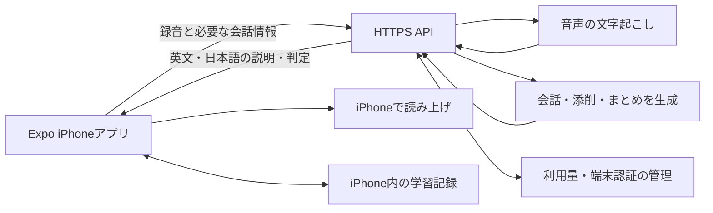

# ビジネス英会話コーチ — iPhoneアプリ設計案

2026年9月23日 / v1.0 / 内容確認用・実装前

## 1. 作るもの

英文を読む段階から日本語の説明が必要な人が、1日15分で自己紹介・雑談・短いプレゼンを練習するiPhoneアプリ。最初は本人が継続利用し、将来は業種を問わないビジネス英語初心者への提供を目指す。

中心となる価値は、質問を理解するための操作、毎日の練習内容の自動選択、別の日にも表現を使えたかの記録を、一つの学習体験としてつなぐこと。会話と要約はGPT-Liveでも大きく重なるため、その有無だけを差別化としない。[ChatGPT Voice公式](https://learn.chatgpt.com/docs/features/voice)

学習期間を固定して流暢さを保証する設計ではない。「昨日言えなかったことを、別の質問でも自分で言えるようになったか」を小さく確認する。

## 2. ユーザーの回答で確定した条件

| 項目 | 決定内容 |
|---|---|
| 対象端末・開発環境 | iPhone。WindowsからReact Native＋Expoで開発 |
| 開始レベル | 英文を読む段階から日本語の説明が必要 |
| 使用時間 | 声を出せる場所で1日15分 |
| 学習順 | 自己紹介 → 短い雑談 → 短いプレゼン |
| 会話相手 | アプリ内のAI講師 |
| 視覚的な補助 | 質問の意図、日本語訳、答え方の型などをボタンで表示 |
| 日本語訳 | AIの質問では必要なときに表示。操作や学習説明は日本語 |
| 発話方法 | 録音開始と停止・送信を操作する。ヒントを選んだ後も本人が発話 |
| 教材 | 架空のビジネス場面＋自分が言えなかったことの日本語入力 |
| 毎日の内容 | 学習状況と苦手に応じて自動提案 |
| 振り返り | 使える表現、言い直し例、次回の復習を自動でまとめる |
| 保存 | iPhone内に会話の文字・表現集・学習状況を保存。ログイン不要 |
| 個人利用の予算 | AI利用料は月1,000円。開発・配布に必要な費用は別枠 |
| 将来の対象 | 業種を問わないビジネス英語初心者 |

以下の画面構成、判定方法、技術構成、予算制御は、この条件を具体化した設計提案。録音の聞き返しについて追加希望はなかったため、前回提案どおり音声履歴を保存しない案としている。まだ実装・実機検証は行っていない。

## 3. 1日の学習体験

ホームで「今日の15分」を押すと、選択に迷わず始められる。初回は復習の代わりに操作説明と短い発話練習を行う。

| 目安 | 内容 | アプリの動き |
|---|---|---|
| 3分 | 前回の復習 | 言えなかった表現を、短い質問で再確認 |
| 2分 | 場面とお手本 | 日本語で状況を説明し、短い英文を聞いてまねする |
| 7分 | 会話練習 | AIが1問ずつ質問。補助を使いながら録音して返答 |
| 2分 | 確認 | 表現を少し変えた質問に、補助を隠して答える |
| 1分 | まとめ | 今日の表現、修正例、次回の内容を確認 |

時間は目安とし、15分を過ぎても発話の途中では打ち切らない。途中終了時も、それまでの記録から短いまとめを作る。途中までの結果を全レッスン完了として扱わない。

### 学習順と自動選択

最初に用意する教材は、次の9場面を提案する。各場面には、初心者向けのお手本、確認したい情報、日本語の説明、返答例を持たせる。

| 段階 | 場面 |
|---|---|
| 自己紹介 | 名前と仕事／担当していること／今取り組んでいること |
| 雑談 | 挨拶と一言／週末や最近の出来事／相手への短い質問 |
| 短いプレゼン | 話題を紹介する／要点と理由を伝える／簡単な質問に答える |

毎日は「復習が必要な表現 → 現在の段階の新しい場面」の順で組み立てる。学習内容の自動提案を基本にしつつ、本人が場面を選び直す操作も用意する。休んだ日は未消化分をすべて積み上げず、当日の15分に収める。

初期の復習間隔は翌日・3日後・7日後を目安にし、言えなかった表現を優先する。この間隔は初版の運用値であり、最適な学習効果を実証したものではない。

## 4. 画面構成

| 画面 | 主な内容・操作 |
|---|---|
| 今日の練習 | 今日の場面、学ぶ表現、開始・再開、場面の変更 |
| 会話レッスン | 質問、補助ボタン、録音・送信、短いフィードバック |
| 今日のまとめ | 表現3つまで、言い直し例、次回の復習、保存・コピー |
| 自分の表現集 | 場面別の表現、日本語の意味、例文、読み上げ、復習状態 |
| 学習記録 | 練習日、使った補助、別日にも返答できた表現 |
| 設定 | 仕事などの任意プロフィール、読み上げ速度、予算表示、記録の削除 |

「今日言えなかったこと」はホームから日本語で入力できる。AIが意味を変えずに、初心者向けの短い表現と会話場面へ変換する。本人が内容を確認した後、次の学習候補へ追加する。プロフィールや実名の入力は必須にしない。

### 質問がわからないときの操作

通常の練習では質問を英語で読み上げ、英文も表示する。日本語全文は初期状態で隠す。

| ボタン | 起こること |
|---|---|
| もう一度 | 同じ質問を再生 |
| ゆっくり | 同じ質問を遅めに再生 |
| 意味を見る | 日本語訳と「何について答える質問か」を表示 |
| 答え方を見る | 短い英文の型と入れ替える部分を表示 |
| 日本語で考える | 言いたいことを日本語で入力し、短い英文のお手本にする |
| 例を聞く | 表示中の返答例を読み上げ |
| 録音する | AIの読み上げを止めて録音開始 |
| 止めて送信 | 録音を止めて文字起こし・返答処理へ進む |

例: “What do you do?” に対し、「仕事について聞いています」「どんな仕事をしていますか？」「I work in ___.」を段階的に表示する。

選択肢を押しただけでは返答完了にしない。意味や内容を選んだ後、本人が声に出す。送信前に取り消して録り直す操作も用意する。

## 5. 教え方と上達の記録

AIの質問は1回に1つ。初期は短い語句と文を使い、場面に必要な内容に絞る。間違いへの説明は発話の後に日本語で示し、1回の返答で直すポイントは原則1つにする。

### 記録する事実

- 質問と本人の返答の文字起こし。
- 日本語訳、答え方の型、日本語下書きなど、使った補助。
- 英文表示、再生回数、ゆっくり再生の利用。
- 質問に必要な情報を含む返答だったかと、その簡潔な理由。
- 表現を初めて練習した日、同日確認、別日確認の結果。

### 達成の扱い

「お手本をまねできた」「同じ日に補助なしで返せた」「別の日の異なる質問にも補助なしで返せた」を区別する。1回の復唱だけで習得済みとしない。

補助なしの確認では、まず音声だけを提示する。英文や意味を表示した場合も続けられるが、その利用を結果に残す。英文を読んで返答できた結果を、音声だけで聞き取れた結果として表示しない。

表現カードの主な状態は「練習中」「同日確認できた」「別日確認できた」。同じ日に何度成功しても別日確認の回数は増やさない。難しかった表現は復習候補に戻す。

AI判定は文字起こしに基づく内容・表現の確認に用いる。文字起こしが不自然な場合は、本人が「聞き取りが違う」を選んで再録音できる。その試行を学習上の失敗と断定しない。発音の精密な点数や実社会での会話力の保証は表示しない。

## 6. レッスン終了後のまとめ

毎回、次の内容を自動保存する。

1. 今日練習した場面と、できたこと。
2. よく使える表現を最大3つ。英文、日本語の意味、使う場面、短い例文。
3. 本人が実際に言った内容と、より伝わりやすい言い直しを最大2組。
4. 次に復習する表現と、翌日の練習予定。

本人の発言は履歴から引用し、AIが作った例文と区別する。添削が不要だった回に、架空の間違いを作らない。表現集への追加は自動で行い、重複する表現は関連する練習記録をまとめる。

まとめの生成中に通信が切れた場合も、会話の文字と補助の利用記録を端末に残す。「まとめを作り直す」で再開できる。

## 7. 技術構成の提案

| 部分 | 提案 |
|---|---|
| アプリ | React Native＋Expo＋TypeScript |
| 録音・再生 | expo-audio |
| 英文の読み上げ | expo-speechによるiPhoneの音声 |
| 学習データ | iPhone内のSQLite。データ形式にバージョンを持たせる |
| API | Cloudflare WorkersでHTTPS APIを提供 |
| サーバーの最小データ | D1に端末認証と利用量・予算管理を保持。学習履歴の同期は行わない |
| 文字起こし候補 | gpt-transcribe |
| 会話・まとめ候補 | gpt-6-luna。短い構造化出力を使い、実際の添削品質を確認する |

録音を文字起こししてからAIが返答するため、送信後に待ち時間がある。処理中は「聞き取り中」「返答を準備中」を表示する。

Expo Goには録音と読み上げが含まれるため、この構成で最初の実機試作を行う。Windowsで開発し、独立したiPhoneアプリへのビルドはEASを利用する。[Expo FAQ](https://docs.expo.dev/faq/#can-i-develop-ios-apps-on-a-windows-computer)・[expo-audio](https://docs.expo.dev/versions/latest/sdk/audio/)・[expo-speech](https://docs.expo.dev/versions/latest/sdk/speech/)

APIキーはサーバー側だけに保存する。ログイン画面は設けず、初回の利用設定で本人の端末を認証し、専用の端末トークンでAPIへ接続する。アプリへ配布する値はAI事業者のAPIキーと分離する。[Expoの環境変数の注意](https://docs.expo.dev/guides/environment-variables/#security-considerations)

モデル名・単価・API呼び出しは画面から分離し、モデル変更時に学習データや操作方法を変えずに済む構成にする。

Cloudflare Workersは外部APIへの中継と秘密情報の保管に使い、D1は端末認証・利用枠の管理に使う。音声の変換処理はサーバーで行わない。1回の録音は最大90秒、受信ファイルは最大5 MBを初期値とし、iPhoneでサイズと品質を確認する。[Workers Request](https://developers.cloudflare.com/workers/runtime-apis/request/)・[Secrets](https://developers.cloudflare.com/workers/configuration/secrets/)・[D1 API](https://developers.cloudflare.com/d1/worker-api/d1-database/)

無料WorkersのCPU時間は1リクエスト10 ms、メモリはisolateあたり128 MB。外部APIの応答を待つ時間はCPU時間に含まれないが、音声の受信・認証・JSON処理が無料枠に収まるかは測定する。D1にも無料枠がある。無料での継続利用を確約せず、実測で収まらない場合は処理を改善し、追加費用が必要な変更は条件を提示する。[Workersの制限](https://developers.cloudflare.com/workers/platform/limits/)・[D1料金](https://developers.cloudflare.com/d1/platform/pricing/)

### WindowsとiPhoneでの検証・配布

開発時はExpo Goで動作を確認する。本人が日常利用する独立したアプリは、EASでビルドし、適切に署名してiPhoneへ導入する。EAS経由のiPhone用開発ビルドやTestFlight配布にはApple Developer Programが必要。年会費は公式には99米ドルまたは現地通貨の同等額で、AI利用料とは別。[開発ビルド](https://docs.expo.dev/develop/development-builds/create-a-build/)・[Appleの登録費用](https://developer.apple.com/jp/programs/enroll/)

将来のApp Store公開、利用者アカウント、課金、クラウド同期は後続の段階とする。初版は、本人のiPhoneで学習の一連の流れが継続して使えるところまでを対象にする。

## 8. 保存と通信

端末には、設定、レッスン履歴、文字起こし、表現カード、補助の利用、復習予定、判定の根拠を保存する。クラウドに学習履歴を同期する機能は初版に含めない。

AI処理のため、録音と必要なテキストはバックエンドとAI事業者へ送信する。「端末保存」は通信を行わないという意味ではない。初回の利用説明にこの点を明記する。

録音は処理用の一時ファイルとして扱う。成功・取消時にアプリの一時ファイルを削除し、失敗した録音は本人の再送か破棄まで一時的に保持する。録音を保存して後から聞き返す機能は設けない。サーバーの永続ストレージやログに会話本文・音声を保管しない設計とし、AI事業者側の取り扱いは別途その設定・ポリシーに従う。

設定から学習記録を消せる。クラウド同期がないため、初版の機種変更時の引き継ぎは保証しない。通常利用の開始前に、この保存範囲を表示する。

## 9. 予算

AI費用の目標は月1,000円以内。2026年9月23日に確認した単価を使った仮の見積もりは次のとおり。[OpenAI公式料金](https://developers.openai.com/api/docs/pricing)

| 項目 | 仮定・単価 | 月額 |
|---|---|---:|
| 音声の文字起こし | 15分×30日×発話50%=225分。推定0.0045米ドル/分 | 1.0125米ドル |
| テキスト入力 | 30万トークン。0.10米ドル/100万トークン | 0.03米ドル |
| テキスト出力 | 課金対象の総出力10万トークン。0.50米ドル/100万トークン | 0.05米ドル |
| 合計 | 端末の読み上げを利用 | 約1.09米ドル |

これは実測前の見積もり。為替、税・決済手数料、再送、開発中の試行、利用量の増加、バックエンド費用は含まない。APIアカウントでのモデル利用可否も実装時に確認する。

アプリは月額見積もりと残りの利用目安を表示する。設定した換算レートと単価に基づき、月800円相当をアプリ側の停止目安として余裕を持たせる。新しいAI処理を開始する前に利用枠を確認し、上限に近づいた場合は保存済み表現の音読・復習へ案内する。課金処理の前後で通信が失敗した場合の無制限な自動再送は行わない。

サーバー側で利用枠を管理し、端末の時計変更や連打で制限を回避できないようにする。同時処理で予算を超えないよう、処理前に利用枠を予約し、処理後に使用量を反映する。使用量管理に失敗した場合は、新しい有料処理を開始しない。事業者側の支出制限も併用する。ただし反映遅延や為替変動があるため、決済額が厳密に指定円額以下になると保証する表示はしない。[支出上限の公式説明](https://developers.openai.com/api/docs/guides/spend-limits)

バックエンドの料金・制限とApple等の配布費は、AI利用料と分けて表示する。外部サービスの契約や支払いは、本設計書の作成では行わない。

## 10. エラー時の動作

| 状況 | 動作 |
|---|---|
| マイク権限なし | 設定方法を表示。許可が取れるまでは録音を開始しない |
| 無音・短すぎる録音 | 再録音を案内。返答が間違っていたとは判定しない |
| 送信中・生成中の連打 | 同じ処理を二重に開始しない |
| 通信失敗 | 処理段階を表示し、再試行を本人が選べる。成功済みの結果があれば再利用 |
| アプリが中断 | 最後に保存した学習状態から再開。途中の録音は扱いを明示 |
| 読み上げ音が出ない | 音量とサイレントモードの確認を案内し、文字は残す |
| AIの返答形式が不正 | 壊れた内容を教材として保存せず、再試行を案内 |
| 予算の停止目安に達した | 新しいAI処理を止め、保存済み教材を利用 |

expo-speechはiPhone実機のサイレントモードでは音が出ないと公式に記載されている。初版の実機検証では解除した状態を基本とし、無音時の案内を確認する。[読み上げの制約](https://docs.expo.dev/versions/latest/sdk/speech/)

## 11. 完成を確認する条件

以下は今後の検証項目であり、現在の検証済み実績ではない。

- Windowsで開発したアプリが本人のiPhoneで動く。
- 自己紹介・雑談・短いプレゼンの各場面で、録音からAIの返答・読み上げまで往復できる。
- 日本語訳と答え方の型を必要時に表示でき、押した後にも本人が発話できる。
- 15分の流れを一通り完了し、アプリを再起動しても会話の文字とまとめが残る。
- 日本語で入力した「言えなかったこと」が教材となり、後の復習に出る。
- 補助を使った結果、同日の確認、別日の確認を区別して保存・表示する。
- 聞き取りの誤り、通信失敗、権限拒否、予算制限、二重送信に対応する。
- APIキーが配布アプリに入らず、認証なしで有料APIを呼べない。
- 実機の通常の通信環境で20往復を測定し、短い返答の送信後、文字の応答が表示されるまでの95パーセンタイル10秒以内を初期の目標とする。超える場合は構成を再評価する。
- 実際の利用量・待ち時間・添削の正確さを記録し、1週間の本人利用で「続けられるか」「以前の表現を使えたか」を確認する。

## 12. 次の段階

この設計書の認識を確認した後、実装順と検証手順を具体化する。最初に録音・文字起こし・AIの返答・読み上げの一往復をiPhoneで確認し、その後に学習の流れ、保存、復習、まとめをつなぐ。

この文書は設計案の成果物であり、アプリの完成報告ではない。外部アカウント作成、API利用、配布、購入は未実施。
