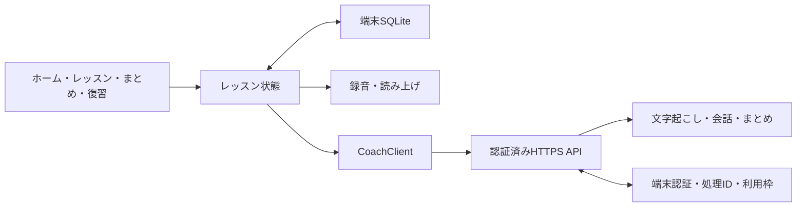

# 自己紹介1レッスン Implementation Plan

> **For agentic workers:** REQUIRED SUB-SKILL: Use superpowers:subagent-driven-development or superpowers:executing-plans to implement this plan task-by-task. Steps use checkbox (`- [ ]`) syntax for tracking.

**Goal:** 本人のiPhoneで、自己紹介1レッスンの質問・日本語補助・録音・AI返答・まとめ・翌日復習を使えるようにする。

**Architecture:** 1つのリポジトリに `mobile/`（Expoアプリ）と `api/`（TypeScriptのHTTPS API）を置く。レッスンの状態・履歴・復習は端末を正とし、APIは文字起こし・会話・まとめと認証/利用枠を担当する。UIから音声、保存、AIクライアント、時計を分離し、固定応答から実APIへ段階的につなぐ。

**Tech Stack:** Expo＋React Native＋TypeScriptは指定条件。npm、expo-audio、expo-speech、expo-sqlite、expo-file-system、expo-secure-store、Cloudflare Workers＋D1、jest-expo / React Native Testing Library、API用Vitestは暫定候補。正確なバージョンとAIモデルは実装時に確認して固定する。

**Spec:** [元の設計案](../../english-coach-design.md)と[決定事項・未決事項](../../development-readiness.md)。HTMLは[画面イメージ](../../english-coach-flow.html)として参照する。

作成日：2026-09-26。準備・初回Git保存の後、「すすめて」を受け実装を開始。チェックボックスは実施した範囲だけ更新する。実機確認はコードの実装と別に扱い、[検証記録](../../iphone-validation.md)に残す。

現在はTask 1〜3のコードを実装し、mobile 36テスト・API 33テスト・型チェック・lint・Expo Doctor・iOS向けexport・Worker dry-runを確認済み。Task 1〜3の実機/実AI完了条件は未達。最初の質問の送信・返答表示までの実装があり、接続設定を残している。Tasks 4〜7、次の質問、端末保存、まとめ画面、復習は未着手。[API契約](../../api-contract.md)と[接続手順](../../api-setup.md)を追加した。

## Global Constraints

- 開発環境はWindows、確認端末はiPhone。初期は1か所のチェックアウトで順に進める。
- Expo＋React Native＋TypeScriptを前提にする。HTMLをアプリ本体として扱わない。
- 1日15分は目安。発話途中でレッスンを時間切れにしない。途中終了を完了扱いにしない。
- 質問は1回に1つ。補助を選んだ後も本人が発話する。説明は日本語、質問・例文は英語。
- ログイン不要。学習記録はiPhone内に保存。実名・勤務先・プロフィール入力は必須にしない。
- AI利用料の目標は月1,000円、開発・配布費は別枠。月800円相当の停止目安は暫定案。
- 録音の初期上限は90秒・5,000,000 bytes。成功/取消/破棄で一時音声を削除する。
- APIキーはサーバーのみ。認証・枠管理が失敗したら、新しい有料処理を開始しない。
- まとめは表現最大3つ、言い直し最大2組。実発言・AI例文を区別し、架空の修正を作らない。
- 補助あり・同日確認・別日確認を区別する。精密な発音点数や習得・会話力の保証は付けない。

## Review Focus

| 入力・状況 | 必要な動作 | 検証するTask |
|---|---|---|
| 意味を開いた後に閉じる・画面を戻る | その回答試行の補助利用が消えず、補助なしの成功に変わらない | 1・4 |
| 送信連打・通信タイムアウト・課金直後の切断 | 重複した有料処理を抑止し、結果不明を自動再送しない | 3 |
| 録音中の着信/ロック・一時音声ファイル消失 | 録音状態を復元したふりをせず、再録音へ案内する | 2・4・7 |
| まとめ生成中に終了・不正JSON・引用の捏造 | 会話を残し、未完成まとめを成功扱いにせず再作成できる | 5 |
| 深夜の日付変更・同日反復・数日休む | 暦日で翌日を判定し、同日回数を別日実績に足さず、復習を積み上げ過ぎない | 6 |

## 1. 最小スコープと教材

「初めて会う同僚に名前と仕事を伝える」1レッスンを固定教材にする。IT分野は例であり、職種や会社名の入力を強制しない。初回は説明・お手本から始め、2回目以降は期限が来た復習を先に出す。

| 用途 | 固定ID | 英語の質問 | 補助と期待する情報 |
|---|---|---|---|
| 練習1 | `intro-name` | What should I call you? | 「何とお呼びすればよいですか？」/「呼び名を答えます」/ You can call me ___. 架空の名前も可 |
| 練習2 | `intro-work` | What do you do? | 「どんな仕事をしていますか？」/「職種や分野を答えます」/ I work in ___. |
| 同日確認 | `intro-work-check` | Can you tell me about your work? | 最初は音声のみ。英文・意味・回答例を必要時に表示 |
| 翌日復習 | `intro-work-review` | What kind of work do you do? | 仕事の表現を別の質問で確認。最初は音声のみ |

通常練習は英文を表示し、意味・型は隠す。「もう一度」「ゆっくり」「意味を見る」「答え方を見る」「例を聞く」を備える。固定質問＋実際の返答に応じた短いAI返答を採用し、次の質問はアプリが選ぶ。自由会話を無制限に生成する方式は後続とする。

お手本、練習2問、仕事の同日確認、まとめを完了すると1レッスン完了。再録音は可能。途中終了なら取得済みの発言から部分まとめを作る。仕事の発話がない場合は仕事の復習カードを捏造せず、次回は未完の練習を案内する。

初期は録音・AI往復を優先し、任意の日本語下書きからの英文生成、「言えなかったこと」の教材化、場面選択、独立した表現集/統計画面、3日・7日復習、通知、クラウド同期、ユーザー課金、App Store公開は後続に置く。翌日復習は翌日にアプリを開いたときに表示する。

## 2. 構成と境界

最初はnpm workspaceや共通パッケージを作らず、`mobile/` と `api/` に別々の `package.json` / `package-lock.json` を持つ。API契約を `docs/api-contract.md` に置き、両側で同じ架空の契約例を検証する。多数の共有型が必要になった時点で共通化を検討する。

| 作成予定の場所 | 責務 |
|---|---|
| `mobile/App.tsx`, `mobile/app.json` | 起動、最小の画面切替、権限設定 |
| `mobile/src/lesson/{content,types,reducer}.ts` | 教材、データ型、状態遷移 |
| `mobile/src/screens/{Home,Lesson,Summary,Review,Settings}Screen.tsx` | 画面。設定は保存/通信説明、トークン設定、削除、速度だけ |
| `mobile/src/components/QuestionSupport.tsx` | 英文・意味・型の段階表示と補助利用通知 |
| `mobile/src/audio/{recorder,speech}.ts` | 録音の開始/停止/取消と読み上げの排他制御 |
| `mobile/src/storage/{database,migrations,lessonRepository}.ts` | SQLiteの初期化、段階保存、再開、削除 |
| `mobile/src/api/{contracts,coachClient,mockCoachClient,deviceToken}.ts` | 検証済みAPI応答、実API/固定応答の切替、安全な端末トークン保存 |
| `mobile/src/summary/buildSummary.ts` | 引用照合、表現カードとまとめの保存単位 |
| `mobile/src/review/{clock,scheduler}.ts` | 学習日の計算、翌日候補、達成の判定 |
| `api/src/{index,auth,budget,requests,provider,schemas}.ts` | ルーティング、端末認証、利用枠、処理ID管理、AI呼び出し、入出力検証 |
| `api/migrations/0001_device_usage.sql` | トークンのハッシュ、月利用枠、処理状態。会話本文を含めない |
| `docs/{api-contract,api-setup,iphone-validation}.md` | API仕様・接続手順・iPhone検証記録。Task 3で作成/更新済み |

### データ契約の暫定案

- `LessonSession`: `id`, `lessonId`, `phase`（prepare/practice/check/summary）、`status`（active/completed/interrupted）、`startedAt`, `studyTimeZone`, `currentQuestionId`, `summaryStatus`（notRequested/pending/ready/failed）。学習完了とまとめ生成成功を別に扱う。
- `Attempt`: `id`, `sessionId`, `questionId`, `mode`（practice/check/review）、`startedAt`, `answeredAt`, `studyDate`, `support`, `transcript`, `evaluation`, `requestIds`, `status`。`support` は英文表示、意味、型、例の再生、再生回数、遅い再生を記録する。取消・聞き取り違い・無音は学習上の失敗として数えない。
- `Evaluation`: `outcome`（answered/retry/unassessed）, `reasonJa`, `replyEn`, `correction`（nullまたは1件）。内容が必要情報を含むかを判定し、発音は採点しない。
- `LessonSummary`: `sessionId`, `sourceAttemptIds`, `achievementsJa`, `phrases`（0–3件）, `rewrites`（0–2件）, `nextReviewDate`（対象がなければnull）。各言い直しは `attemptId` と引用元テキストを持つ。
- `PhraseCard`: `id`, `lessonId`, `english`, `meaningJa`, `usageJa`, `exampleEn`, `sourceAttemptIds`, `state`（practicing/sameDayConfirmed/differentDayConfirmed）。意味・場面を含む正規化キーで重複をまとめる。
- `ReviewItem`: `id`, `phraseId`, `sourceStudyDate`, `sourceQuestionId`, `dueStudyDate`, `lastReviewedStudyDate`, `status`（due/done）。同じカードの同日復習項目を重複作成しない。

日時はUTCのISO文字列と学習日の `YYYY-MM-DD` を保存する。学習タイムゾーンは初期値 `Asia/Tokyo` として保存し、実行時のOS設定変更で過去の学習日を書き換えない。端末に残す一時音声のURIは削除可能な処理メタデータとし、履歴の恒久的な一部にしない。

### 状態とAPIの暫定案

録音/通信の状態は `idle → recording → transcribing → replying → feedback` とし、`error` に失敗段階を持たせる。次の質問へ進むのはフィードバック確認後。録音開始前にTTSを止め、連打をUIとAPIの両方で抑止する。

| API | 入力 | 成功出力 |
|---|---|---|
| `POST /v1/transcriptions` | Bearer端末トークン、処理ID、音声multipart、durationMs | 処理ID、transcript、実使用量 |
| `POST /v1/replies` | 処理ID、固定lessonId/questionId、transcript、補助、必要な直近ターン | 処理ID、Evaluation、実使用量 |
| `POST /v1/summaries` | 処理ID、sessionId、終了種別、保存済みAttemptのスナップショット | 処理ID、LessonSummary、実使用量 |

端末が `transcript` を保存してからreplyへ進むため、実処理に合う「聞き取り中」「返答を準備中」を表示できる。各有料段階に一意の処理IDを割り当てる。制限・入出力・エラー形式をTask 3でJSONスキーマに固定する。

サーバーは認証、入力の上限、月利用枠の原子的な予約、処理IDの重複確認を終えてからAIを呼ぶ。月境界はサーバーで `Asia/Tokyo` として判定。利用上限はクライアントの申告に依存しない。音声の長さが信頼できない場合の最大課金額をファイル上限から保守的に予約し、十分な上限を計算できなければ有料接続を進めない。

会話本文・音声・生成結果はD1やログへ永続保存しない。処理IDと状態・利用量は永続化する。同じIDの再要求は再課金せず、端末に保存済みならその結果を使う。サーバー処理済みでも端末が結果を失った場合は結果再取得を保証せず、`RESULT_UNAVAILABLE` として扱う。結果不明の予約枠を自動解放して再送しない。本人が新しい試行を選ぶ場合も別IDで利用枠を再確認する。この制約はU8として有料接続前に確定する。

## 3. 実装タスク

依存順は **1 → 2 → 3 → 4 → 5 → 6 → 7**。Task 3で実AIとの一往復を確認してから学習全体をつなぐ。認証情報が用意できない場合は4–6を固定応答で進められるが、実AI接続と最終完了は保留する。各Taskで変更したファイルを明示して小さくコミットする。

### Task 1: iPhoneで質問と補助を表示する土台

**Files:** 上表の `mobile/App.tsx`, `mobile/app.json`, `mobile/src/lesson/*.ts`, `mobile/src/components/QuestionSupport.tsx`, Home/ Lesson画面。加えて `mobile/package.json`, lockfile, `tsconfig.json`, `jest.config.js`, `eslint.config.js`, `mobile/src/lesson/reducer.test.ts`, `mobile/src/components/QuestionSupport.test.tsx`、READMEを作成/更新。

**Interfaces:** `getQuestion(questionId: string): Question`、`lessonReducer(state: LessonState, event: LessonEvent): LessonState`。Questionは上記教材のID・英語・日本語の意図/意味・型・例を持つ。LessonStateはSession・現在のAttempt・録音/通信状態を持つ。

- [ ] U1/U2を確認し、採用SDKと実機のExpo Go互換性を記録する。既存docsを保護するため、リポジトリ直下ではなく空の `mobile/` に初期化する。
- [x] 当日のCLIオプションを確認して `--template blank-typescript@sdk-57 --no-agents-md --yes` で `mobile/` を初期化。生成物内に別のGitリポジトリがないことを確認。
- [x] `mobile` に `typecheck`（`tsc --noEmit`）、`lint`、`test`（jest-expo）、`start`（Expo）を用意し、TypeScript strictとlockfileを管理する。Expo依存は互換バージョンで導入する。
- [x] 先に状態テストを書く。意味を開閉しても `support.meaningViewed === true`、初回はprepare、通常練習は英文表示、check/reviewは英文非表示、補助操作だけではfeedbackへ進まないことをassertする。
- [x] `npm.cmd test -- --runInBand`（作業場所 `mobile`）で未実装による失敗を確認し、最小の状態遷移と日本語補助UIを実装して成功させる。
- [x] `npm.cmd run typecheck` と `npm.cmd run lint`、`npx.cmd expo-doctor` を実行する。
- [ ] `npx.cmd expo start --go` でiPhoneに質問を表示する。架空の応答モードは画面で明示する。
- [x] 検証結果をREADMEに反映し、`feat: add self-introduction lesson shell` でコミットする（`222eb2c`）。

**完了条件:** Windowsから起動したアプリがiPhoneで開き、意味と回答例を任意に表示できる。まだAI対応済みとは表示しない。

### Task 2: 実機で録音・取消・読み上げを確認

**Files:** `mobile/src/audio/recorder.ts`, `speech.ts`, `recorder.test.ts`、Lesson画面、`mobile/app.json`, package/lockfile、`docs/iphone-validation.md`。

**Interfaces:** `startRecording(): Promise<void>`、`stopRecording(): Promise<Recording | null>`、`discardRecording(): Promise<boolean>`、`speakEnglish(text: string, slow: boolean): Promise<void>`、`stopSpeech(): Promise<void>`。Recordingは `uri`, `mimeType`, `durationMs`, `sizeBytes` を持つ。コントローラーが現在の録音を保持し、破棄の成功を返す。失敗時はファイルと再試行手段を残し、画面を離れない。低レベルdriverが `discard(recording): Promise<void>` を担当する。

- [x] `npx.cmd expo install expo-audio expo-speech expo-file-system` を実行し、SDK 57のアダプターを作成。peer依存 `expo-asset` も追加。バックグラウンド録音は無効。
- [x] 権限拒否なら録音しない、開始前にTTSを止める、取消で送信せず削除、90秒で自動停止して送信は本人が選ぶ、5,000,001 bytesなら送信不可、というテストを書き失敗を確認する。
- [x] 最小実装後に関連テストを通す。1秒未満や空ファイルをエラーにし、破棄して録り直せるようにする。読み上げの遅延開始、ネイティブ自動停止/中断、削除失敗の回帰テストも追加する。
- [ ] 無音の検出/文字起こし空欄の扱いは実機とAPIで調整し、学習失敗にしない。失敗録音の再送/アプリ再起動後の回復はTask 3・4と結合して確認する。
- [ ] iPhoneで通常録音、権限拒否/再許可、サイレントモード、録音中のロック/中断、再起動後の一時ファイルを確認する。バックグラウンド移行時は録音を停止し、復帰後に再録音/破棄を案内する。
- [ ] Task 3でPCM WAVへ変更した形式の実際のMIME・長さ・サイズを記録し、AI APIの受理を確認する。音声そのものはGitに入れない。Task 2のコードは `2acf11f` にコミット済み。

**完了条件:** iPhoneで録音して取り消せる。質問・例文の読み上げと録音が重ならない。自動テストを実機確認の代用にしない。

### Task 3: 認証・利用枠付きAPIで一往復

**Files:** 上表の `api/src/*.ts`, `api/migrations/0001_device_usage.sql`, `api/package.json`, lockfile, `tsconfig.json`, `wrangler.jsonc`, `vitest.config.ts`, `.dev.vars.example`, `api/test/{auth-budget,requests,contracts}.test.ts`、`docs/api-contract.md`、`mobile/src/api/*.ts`, `mobile/.env.example`。

**Interfaces:** `CoachClient.transcribe(recording: Recording, requestId: string): Promise<TranscriptResult>`、`reply(input: ReplyInput, requestId: string): Promise<ReplyResult>`、`summarize(input: SummaryInput, requestId: string): Promise<SummaryResult>`。全応答は処理IDを含み、失敗は `code`, `stage`, `retryable`, `requestId` で区別する。`reserveUsage` と `settleUsage` は原子的に扱う。実装の詳細はAPI契約を参照する。

- [x] U3/U4/U6/U8の実装方針を具体化。モデルID、入力形式、公式単価、管理用換算、最大出力、月境界、停止枠、確定失敗時の扱いをAPI契約に記録。アカウントの実利用権・料金は接続時に確認する。
- [ ] 契約と架空の入出力例を定義する。名前/仕事の正答、言い直し不要、空欄、質問と無関係な発話、不正JSONを含める。文字起こし/各発言は最大500文字、replyの過去文脈は最大8ターン、summaryは最大16試行として上限を固定し、超過は明示エラーにする。固定lessonId/questionIdをサーバーで検証する。
- [x] モックのAI事業者を使うテストを先に書く。トークンなしは401、期限切れ/失効は403、音声超過は413、同じ処理IDは外部API呼び出し1回、枠不足/DB障害は呼び出し0回、同時予約で枠を超えないことをassertする。
- [x] APIテストの未実装による失敗を確認し、認証・D1・利用枠・入力検証・AIアダプターを実装して成功させた。発話は教材データとして渡し、出力もスキーマ検証。typecheck成功。
- [ ] タイムアウト・事業者応答後の切断・usage確定失敗をテストする。永続化するのはメタデータのみとし、同じIDを自動再課金しない。定額予算を保証する表示は使わない。
- [ ] 本人用の失効可能トークンを管理側で発行し、アプリの初回設定からSecureStoreへ保存する。`EXPO_PUBLIC_API_BASE_URL` は公開URLのみ。秘密はWorker secrets / ローカル `.dev.vars` に置く。
- [ ] iPhoneから到達できるHTTPS開発APIへ接続し、録音 → 文字起こし → 実発話に応じた返答 → 読み上げを確認する。iPhoneの `localhost` はWindowsを指さない。Expoトンネルはバックエンドの公開を代行しない。
- [ ] APIのtypecheck/testとmobileのtypecheck/関連テストを通し、キー混入・本文ログを確認する。結果を記録し `feat: connect authenticated coaching API` でコミットする。

**完了条件:** 実AIで1往復でき、未認証・予算停止・連打・異常応答を制御できる。固定応答だけならこのTaskは未完了。

2026-09-27のコード到達点：3つのAPI、共有reply fixture、端末コード発行スクリプト、SecureStore設定画面、名前1問の送信・返答表示を実装。通信失敗/不正出力/確定失敗・連打のローカルテストは成功。文字起こしの保持はメモリー内と保存用コールバックまで。コードを先に保存し、実トークン発行・外部公開・本人のiPhoneでの接続、質問と無関係な実発話などの品質確認は残件として扱う。

2026-10-04の設定進捗：D1の実IDを `DB` bindingへ設定し、リモート初期マイグレーションとowner-iphone登録が完了。本人が既に発行したコードを保持し、ハッシュ一致・有効期限・未失効を確認した。APIの33テスト・型チェック・dry-runを再確認。OpenAIキー設定・公開・実機のSecureStore保存と実AI接続は未確認のため、Task 3全体の完了条件は引き続き未達。

### Task 4: 会話と補助をSQLiteに保存して再開

**Files:** `mobile/src/storage/{database,migrations,lessonRepository}.ts`, `lessonRepository.test.ts`、reducer、Lesson/Home画面、package/lockfile。

**Interfaces:** `saveSession(session: LessonSession): Promise<void>`、`saveAttempt(attempt: Attempt): Promise<void>`、`loadActiveSession(): Promise<LessonSession | null>`、`listAttempts(sessionId: string): Promise<Attempt[]>`、`deleteLearningData(): Promise<void>`。

- [ ] `expo-sqlite` を導入し、schemaVersionを持つ初期migrationを作る。セッション・試行・補助・まとめ・表現・復習予定をIDで関連付ける。SQLiteアダプターのテストと実機永続化確認を分ける。
- [ ] ストレージ契約テストを先に書く。同じAttempt保存で行が増殖しない、transcript保存後のreply失敗でも文字が残る、補助の開閉/再起動で履歴が消えない、未完セッションを再開できることをassertする。
- [ ] 失敗を確認してから段階保存を実装する。補助変更時・録音停止時・文字起こし受信時・AI返答受信時・画面遷移時に保存する。使った補助を再録音で消さない。同じ質問のやり直しは直前の補助履歴を引き継ぐ。
- [ ] 「聞き取りが違う」で対象試行を評価対象外にし、再録音を新しいAttemptとして作る。途中録音の状態をそのままrecordingに復元せず、ファイルの存在と前回処理段階を確認して案内する。
- [ ] 契約テストとtypecheckを通し、iPhoneのアプリ終了/再起動で途中の会話を再開する。記録削除で学習DBと一時音声を消すが、課金枠をリセットしない。`feat: persist lesson progress on device` でコミットする。

**完了条件:** 会話・文字起こし・補助利用が再起動後に残り、完了と中断を区別できる。

### Task 5: 終了後のまとめと表現カード

**Files:** `mobile/src/summary/buildSummary.ts`, `buildSummary.test.ts`、Summary画面、lessonRepository、APIのschemas/providerと契約テスト。

**Interfaces:** `validateSummary(input: unknown, attempts: Attempt[]): LessonSummary`、`saveSummaryWithPhrases(summary: LessonSummary): Promise<void>`。後者はまとめと表現カードの一括保存を行い、同じsessionの再生成で重複させない。

- [ ] 先にテストを書く。表現4件・修正3件は不正、存在しないAttemptからの引用は不正、元発言と異なる引用は不正、修正不要なら空配列、再保存でカードを増やさないことをassertする。
- [ ] テスト失敗を確認し、保存済み会話のスナップショットからまとめ生成・出力照合・SQLiteトランザクションを実装する。引用元の正誤をAIの自己申告だけで判断しない。
- [ ] pending/failedを表示し、再生成中も会話を残す。未発話なら有料生成せず「まだ発話記録がありません」。途中終了なら部分まとめとし、完了ラベルを付けない。
- [ ] まとめ生成中のオフライン、アプリ終了、不正JSONから復旧するテストを通し、iPhoneで再起動後のまとめ/表現カードを確認する。`feat: save grounded lesson summaries` でコミットする。

**完了条件:** 実際の学習だけをまとめ、失敗時にも履歴を失わず「まとめを作り直す」を使える。

### Task 6: 翌日、別の質問で復習

**Files:** `mobile/src/review/{clock,scheduler}.ts`, `scheduler.test.ts`、Review/Home画面、lessonRepository、buildSummary。

**Interfaces:** `studyDate(now: Date, timeZone: string): string`、`scheduleNextDayReview(summary: LessonSummary, attempts: Attempt[]): ReviewItem[]`、`getDueReviews(today: string): Promise<ReviewItem[]>`、`applyReviewResult(item: ReviewItem, attempt: Attempt): ReviewItem`、`derivePhraseState(attempts: Attempt[]): PhraseCard['state']`。最後の関数には、そのカードに関連する試行だけを渡す。

- [ ] 固定時計でテストを書く。2026-09-26の練習は2026-09-27が期限。同日は期限前、翌日と数日後は対象。同日に何度成功しても別日成功は増えない。
- [ ] 追加テストとして、UTCでは同日でも東京で日付が変わる境界、ヒント利用、同一質問、聞き取り違いをassertする。同日のcheckで別質問に成功した場合だけsameDayConfirmedとなり、通常練習の成功だけならpracticingに留まることも確認する。補助なしの確認は英文/意味/型/例の利用なし、再生1回、遅い再生なしの厳しい暫定基準とし、各利用の事実は個別表示する。
- [ ] テスト失敗を確認し、仕事の実発話から得たカード1件を優先して翌日の復習を作る。同じカードの未処理項目を日ごとに積み増さず、期限切れは古い未処理1件として出す。3日/7日アルゴリズムは実装しない。
- [ ] `derivePhraseState` をまとめ保存と復習結果保存から使う。同日checkはsameDayConfirmed、別日・別質問・補助なしで `outcome=answered` の場合だけdifferentDayConfirmedにする。難しい/補助ありの最新確認はpracticingとして翌日へ回すが、過去の成功履歴は消さない。オフラインやAI停止中の音読はAI確認済みにしない。
- [ ] 関連テストを通し、開発用の時計差し替えで翌日表示を確認する。本番の端末時計やサーバー課金時計を変更しない。`feat: add next-day review for introductions` でコミットする。

**完了条件:** 再起動後に期限の来た復習が表示され、音声だけ/補助あり・同日/別日の結果を正しく記録できる。

### Task 7: iPhoneで全体を受け入れ確認

**Files:** `mobile/src/screens/SettingsScreen.tsx`、各画面のエラー/説明、`mobile/src/lesson/lessonFlow.test.tsx`、`docs/iphone-validation.md`、README、決定事項一覧。

- [ ] 初回の保存/通信説明、音声非保存、ログイン不要、同期/引き継ぎの範囲、予算停止、マイク設定への案内を整える。トークンや技術的な処理IDを通常の学習画面に出さない。
- [ ] 一連の統合テストを固定時計・固定AIで先に作り、初回 → 補助 → 発話 → 2問 → 同日確認 → まとめ → 翌日復習を検証する。補助を使った試行が独力成功にならないこともassertする。
- [ ] mobileで `npm.cmd run typecheck`, `npm.cmd run lint`, `npm.cmd test -- --runInBand`, `npx.cmd expo-doctor`、apiで `npm.cmd run typecheck`, `npm.cmd test -- --run` を実行する。失敗を修正してから実機確認へ進む。
- [ ] 下表の受け入れ条件をiPhoneで確認し、機種/iOS/Expo SDK/通信環境、結果、既知の問題を検証記録に書く。実データ本文や録音は掲載しない。
- [ ] 実APIの短い返答を20往復測り、送信から文字表示までのp95が10秒以内という初期目標を評価する。達しなければ実測値と対策を記録し、達成済みと書かない。利用量・推定費用も確認する。
- [ ] READMEを実際に使える起動手順・設定例・制約に更新し、U1–U10を解消/残件に分類する。`feat: complete introduction lesson flow` でコミットする。

| 受け入れ条件 | 確認方法 |
|---|---|
| 質問 → 補助 → 本人の録音 → 実AI返答 | iPhoneで実発話し、固定サンプルではない返答を確認 |
| TTS、権限拒否、無音、録り直し、中断を扱える | 各操作を実機で行い、誤って成功/失敗評価が付かないことを確認 |
| 通信切断・連打・不正出力・上限到達 | 障害を注入し、履歴保持と重複課金抑止を確認 |
| 終了後のまとめと最大3表現/2修正 | 引用元を確認し、再起動後も残ることを確認 |
| 翌日に復習し、補助/別日の違いが残る | テスト時計に加え、実際の翌日にも同じiPhoneで確認する |
| 秘密情報と学習データの境界 | アプリバンドルにAIキーなし、未認証API拒否、サーバーログに音声/本文なしを確認 |
| 途中終了・データ削除・予算停止後も使い方が分かる | 未完を完了扱いにせず、保存済み教材へ移れることを確認 |

実際の翌日確認が済むまでは到達点を完了扱いにしない。その後の1週間の本人利用で継続しやすさ・表現の再利用を評価する。EASでの独立アプリ化はこの結果を踏まえる。

## 作業場所とGit運用

準備一式を既存の `main` に初回コミットしてGitHubへpushする。その後は同じチェックアウトで `git switch -c codex/self-introduction` を使う想定。Task単位で検証してコミットし、レビュー可能な区切りでpushする。

worktreeは、Expoの起動手順・音声一往復・API契約・保存/復習のテストが安定し、独立した作業（例：表現集UIと別教材）が同時に必要になったときに検討する。その際は既存の変更と実行中のMetroを確認し、API契約・SQLite migration・lockfileを同時に変更する作業を分離しない。チェックアウトごとのMetroポート・環境設定・端末の接続先を決める。今回の準備では作成しない。

## 実装前に再確認する公式資料

2026-09-26に参照。ここでは方向性の確認に使い、実装時に選ぶバージョンの資料でAPIを再確認する。

- [Expoの作成とWindows要件](https://docs.expo.dev/get-started/create-a-project/)・[TypeScriptテンプレート/CLI](https://docs.expo.dev/more/create-expo/)
- [WindowsでのiPhone確認とEAS](https://docs.expo.dev/faq/#can-i-develop-ios-apps-on-a-windows-computer)
- [録音](https://docs.expo.dev/versions/latest/sdk/audio/)・[読み上げとサイレントモード](https://docs.expo.dev/versions/latest/sdk/speech/)
- [SQLite](https://docs.expo.dev/versions/latest/sdk/sqlite/)・[SecureStore](https://docs.expo.dev/versions/latest/sdk/securestore/)
- [公開環境変数の注意](https://docs.expo.dev/guides/environment-variables/#security-considerations)
